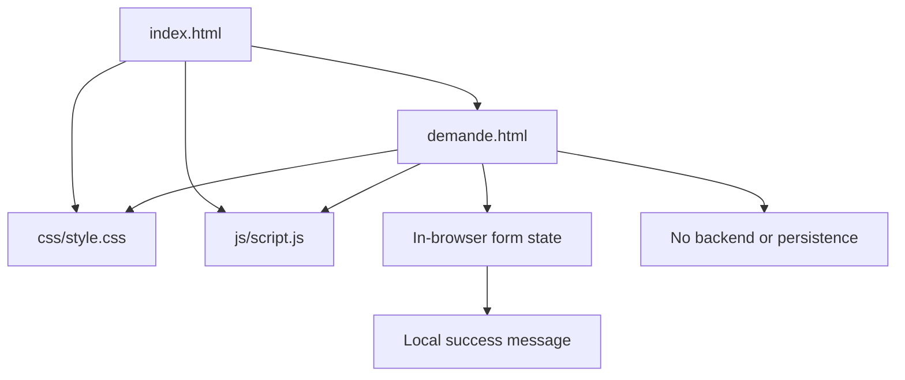

# CAP VERT ENERGIE - Complete Project Report

## 1. Project identity

**Project name:** CAP VERT ENERGIE

**Repository:** `Iyedtawila/Awedi`

**Repository visibility:** Private

**Project type:** Responsive static frontend website

**Language of the interface:** French

**Business domain:** Photovoltaic solar-energy projects for individuals and professionals in Tunisia

**Geographic context:** The company is presented as being based in Manouba, Tunisia.

The website is designed as a clear first contact point for people who want to understand solar solutions and request a first project study.

## 2. Objectives

The website has five primary objectives:

1. Present CAP VERT ENERGIE and its solar-energy positioning.
2. Explain the practical benefits of photovoltaic installations.
3. Separate the offer into residential and professional solutions.
4. Explain the project journey from request to installation.
5. Collect enough information in a guided frontend form to start a future project study.

The experience is intentionally simple: the visitor can discover the offer, read answers to common questions, and move to the request form from several calls to action.

## 3. Current scope

### Implemented

- Responsive home page.
- Responsive request form page.
- Desktop navigation.
- Mobile navigation menu.
- Anchor navigation between sections.
- Six-step form flow.
- Required-field validation.
- Email format validation.
- Phone format validation.
- Required radio-group validation.
- Progress indicator for the form.
- Previous and next step controls.
- Multiple image selection and in-browser previews.
- Client-side success message after the final step.
- Accessible page landmarks, labels, alternative text, skip link, and ARIA attributes.

### Not implemented

- Backend API.
- Database or permanent storage.
- Email delivery.
- Authentication or user accounts.
- Payment or quotation calculation.
- Real CRM integration.
- Server-side validation.
- File upload to cloud storage.
- Analytics configuration.
- Automated test suite.
- Build pipeline or bundler.

The request form currently states that it is a frontend prototype and that information is not sent to a server.

## 4. Repository structure

```text
Awedi/
|-- index.html
|-- demande.html
|-- README.md
|-- PROJECT_REPORT.md
|-- logo.png
|-- logo.jpg
|-- css/
|   `-- style.css
`-- js/
    `-- script.js
```

### `index.html`

The public home page. It contains the brand header, hero section, trust strip, benefits, about section, solution cards, process section, FAQ, call-to-action section, and footer.

### `demande.html`

The project request page. It contains the explanatory sidebar, six form steps, progress UI, navigation buttons, photo input, and success state.

### `css/style.css`

The shared visual system and layout rules. It defines CSS variables, typography, responsive layouts, buttons, navigation, hero illustration, cards, form controls, footer, and mobile breakpoints.

### `js/script.js`

The shared browser behavior. It initializes the mobile menu when present and initializes the request form only when `#project-form` exists.

### `logo.png`

The compact circular brand mark used in the header.

### `logo.jpg`

The wider logo artwork used in the home-page footer.

## 5. Architecture and technical model

This is a small multi-page static site rather than a component-based application.



### Architectural choices

- HTML owns the page structure and content.
- CSS owns presentation, layout, responsive behavior, and visual states.
- JavaScript owns progressive enhancement and form interaction.
- There is no framework, package manager, bundler, or runtime dependency.
- Both pages use the same stylesheet and script so navigation and design stay consistent.

The script is defensive: it looks for the mobile menu before binding menu events, and it returns early when the request form is absent. This allows one JavaScript file to serve both pages without errors caused by missing page-specific elements.

## 6. Page model

### Home page sections

1. **Header and navigation**
   - Compact brand mark and text brand name.
   - Desktop navigation links.
   - Mobile menu toggle.
   - Main conversion link to the request form.

2. **Hero**
   - Solar positioning statement.
   - Primary and secondary calls to action.
   - CSS illustration of a house with solar panels.
   - Supporting statement about producing cleaner energy locally.

3. **Trust strip**
   - Adapted project study.
   - Support for individuals and professionals.
   - Manouba, Tunisia location.

4. **Benefits**
   - Four reasons to use solar energy: lower bills, renewable energy, adapted solutions, and long-term investment.

5. **About**
   - Company presentation.
   - Manouba location.
   - ANME eligibility reference as written in the page content.

6. **Solutions**
   - Residential solution card.
   - Professional/activity solution card.

7. **Process**
   - Request.
   - Initial study.
   - Support and feasibility review.
   - Solar project installation stage.

8. **FAQ**
   - Installation cost.
   - Roof suitability.
   - Consumption information.
   - Roof photos.

9. **Final call to action**
   - Direct link to the request form.

10. **Footer**
    - Full logo artwork.
    - Navigation links.
    - Phone, email, and address.

### Request page sections

- Introductory project-study message.
- Contact information.
- Six-step form panel.
- Progress indicator.
- Local success state.

## 7. Form data model

The form is modeled as six ordered steps. The browser keeps the values in the native form controls while the user moves between steps.

### Step 1: Contact information

- `fullname`: required text.
- `phone`: required telephone number.
- `email`: required email address.
- `city`: required city.
- `address`: required building address.

### Step 2: Property

- `propertyType`: required select: house, apartment, professional premises, industrial building, or other.
- `status`: required select: owner or tenant.
- `buildingArea`: required positive numeric surface area.

### Step 3: Roof

- `roofType`: required select: flat, sloped, other, or unknown.
- `roofArea`: optional positive numeric available area.
- `orientation`: required select: south, east, west, north, or unknown.
- `shade`: required select: yes, no, partial, or unknown.

### Step 4: Consumption

- `knowsConsumption`: required radio choice.
- `annualConsumption`: optional numeric annual consumption in kWh.
- `billAmount`: optional numeric monthly bill amount in DT.

### Step 5: Photos

- `photos`: optional multiple PNG/JPEG file input.
- Files are previewed locally with `FileReader`.
- Files are not uploaded or saved.

### Step 6: Project message and consent

- `message`: optional project description.
- `consent`: required checkbox for the frontend demonstration.

### Future backend request model

If a backend is added, the browser form could be converted into a request object similar to:

```json
{
  "contact": {
    "fullName": "string",
    "phone": "string",
    "email": "string",
    "city": "string",
    "address": "string"
  },
  "property": {
    "type": "string",
    "status": "string",
    "buildingAreaM2": "number"
  },
  "roof": {
    "type": "string",
    "areaM2": "number|null",
    "orientation": "string",
    "shade": "string"
  },
  "consumption": {
    "known": "boolean",
    "annualKwh": "number|null",
    "monthlyBillDt": "number|null"
  },
  "photos": [],
  "message": "string",
  "consent": "boolean"
}
```

This is a conceptual model for future development. It is not currently sent by the application.

## 8. Interaction model

### Mobile navigation

- The menu button reads the current `aria-expanded` state.
- Clicking the button toggles the `is-open` class on `.site-nav`.
- Clicking a navigation link closes the menu.
- CSS controls visibility, opacity, and vertical transition.

### Form stepper

- `stepIndex` stores the active zero-based step.
- `showStep(index)` toggles `.is-active` on the matching fieldset.
- The displayed step counter is `index + 1`.
- Progress width is calculated as `(index + 1) / numberOfSteps * 100`.
- The previous button is hidden on the first step.
- The next button is hidden on the last step.
- The submit button is visible only on the last step.

### Validation

Validation runs before moving to the next step and before final submission.

- Required fields cannot be empty.
- Email uses a basic `name@domain.tld` pattern.
- Phone accepts an optional plus sign, digits, spaces, parentheses, and hyphens, with at least eight characters.
- Required radio groups need one selected option.
- Errors receive `.has-error` and a nearby `.error-message` is populated.
- Editing a field clears its local error.

### Submission behavior

The form prevents the browser's default network submission. When the last step is valid:

1. The form is hidden.
2. The panel heading and progress bar are hidden.
3. The success message is shown.
4. The page scrolls to the top.

No request leaves the browser.

## 9. Design system

### Design direction

The interface uses a clean, editorial solar-energy direction: calm neutral backgrounds, green energy accents, dark readable text, bright yellow sun references, and strong typographic hierarchy.

The design aims to feel professional and approachable rather than technical or industrial.

### CSS variables

The main variables include:

- `--ink`: primary dark text.
- `--muted`: secondary text.
- `--green`: main green accent.
- `--green-dark`: button and emphasis green.
- `--lime`: lighter green accent.
- `--sun`: yellow solar accent.
- `--paper`: warm off-white page background.
- `--line`: light separator color.
- `--dark`: dark section and footer color.
- `--white`: white surface color.
- `--serif`: Space Grotesk display family.
- `--body`: DM Sans body family.

The variable named `--serif` is a naming convention only; its assigned font is the sans-serif display font Space Grotesk.

### Typography

- **Space Grotesk:** headings, brand, and display text.
- **DM Sans:** body text, labels, navigation, and controls.
- Headings use weight and italic emphasis to create a distinctive rhythm.
- Body copy is kept readable with generous line height.

### Layout

- A centered `.container` constrains content width.
- Desktop sections use grids for hero content, benefits, solutions, process, FAQ, and footer.
- Mobile layouts collapse into one-column flows.
- The header and form controls use stable dimensions to avoid layout shifts.

### Responsive breakpoints

- Around `900px`: navigation spacing and major grids adapt; many two-column sections become one column.
- Around `600px`: mobile header, menu, typography, stacked actions, single-column content, and compact illustrations are enabled.

### Visual illustration strategy

The hero and solution visuals are built with HTML elements and CSS shapes. This keeps the page lightweight and avoids external illustration dependencies. The actual brand assets remain image files because they are identity artwork rather than interface decoration.

## 10. Accessibility and usability

Current accessibility measures include:

- `lang="fr"` on both documents.
- Viewport metadata for responsive rendering.
- Descriptive page titles and meta descriptions.
- Skip link to the main content.
- Semantic `header`, `main`, `nav`, `section`, `article`, `footer`, `form`, `fieldset`, and `legend` elements.
- Labels associated with form controls through nesting.
- Alternative text for logos.
- `aria-label` on major navigation and the solar illustration.
- `aria-expanded` and `aria-controls` on the mobile menu.
- `aria-live="polite"` for the photo preview region.
- Keyboard-friendly native links, buttons, selects, details, and form controls.

Potential future improvements include more explicit focus styling, an `aria-live` validation summary, file-size/type error messages, and stronger screen-reader announcements when the active step changes.

## 11. External dependencies

The project has no JavaScript package dependencies and no build dependencies.

It loads two Google Fonts from the web:

- DM Sans.
- Space Grotesk.

The page will still render with fallback sans-serif fonts if the font request fails.

## 12. Local development and deployment

### Local development

The simplest option is opening `index.html` directly. A static server is recommended for more realistic browser behavior.

Example options:

- VS Code Live Server.
- Python SimpleHTTPServer.
- Any static hosting provider.

There is no install command and no build command.

### Deployment

The project can be deployed as static files to GitHub Pages, Netlify, Vercel static hosting, or a traditional web server. The entry document is `index.html`.

For GitHub Pages, the repository must be configured to publish the `main` branch from the project root. The form will remain a frontend demo until a backend endpoint is implemented.

## 13. Recommended next development stages

1. Add a backend endpoint for project requests.
2. Add server-side validation matching the browser rules.
3. Store requests in a protected database.
4. Upload photos to controlled storage with file size and MIME validation.
5. Send an acknowledgment email to the requester and notification email to the company.
6. Add spam protection and rate limiting.
7. Add a privacy policy and explicit data-retention explanation.
8. Replace the local success state with API success and error states.
9. Add automated browser tests for navigation and all six form steps.
10. Add analytics only after consent and privacy requirements are defined.
11. Improve SEO with structured business data and social sharing metadata.
12. Add a favicon and optimized responsive image variants.

## 14. Summary for an AI report generator

CAP VERT ENERGIE is a French-language, responsive static website for a Tunisian photovoltaic company. It uses semantic HTML, a shared minified CSS file, and a small vanilla JavaScript file. The home page explains the company, benefits, residential and professional solutions, project process, and FAQ. A second page provides a six-step frontend-only project request form covering contact details, property, roof, electricity consumption, photos, project description, and consent.

The central design model is a conversion journey: discover the solar offer, understand its value, select a relevant audience, resolve common questions, and request a first study. The current application has no backend, authentication, database, network form submission, or permanent data storage. It is ready to serve as a polished frontend prototype and as a foundation for future API and business-workflow integration.
